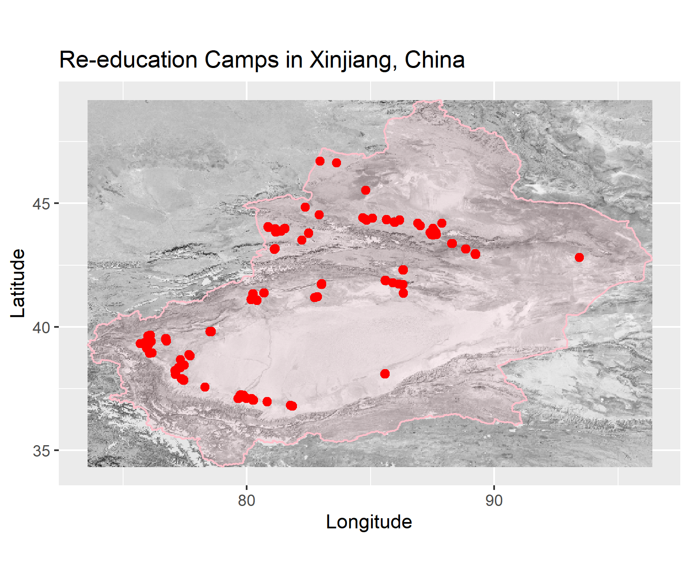
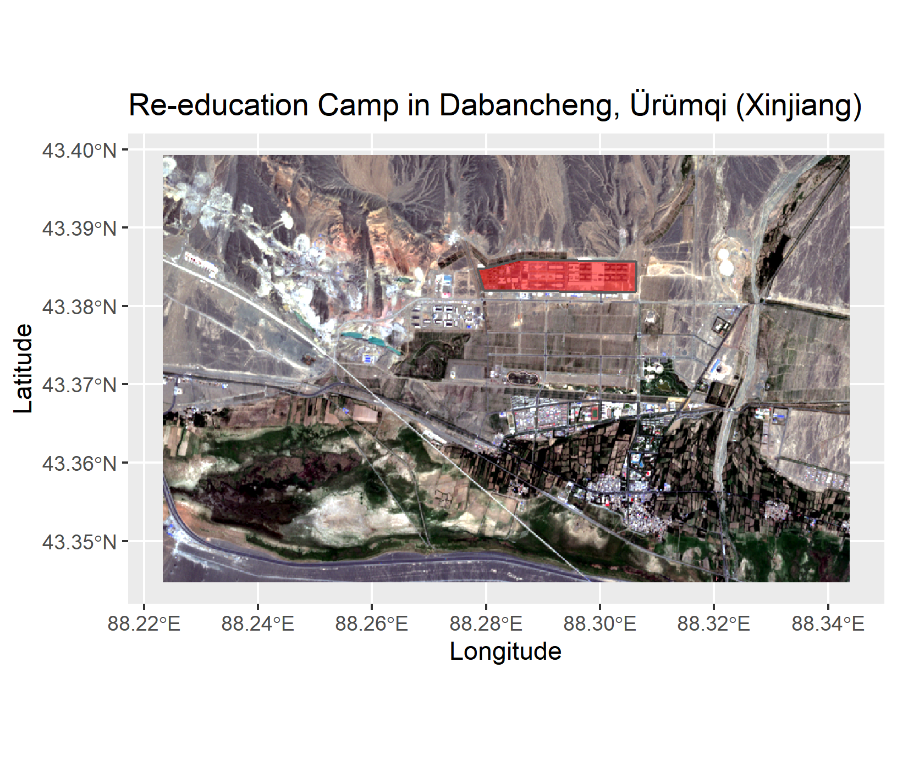
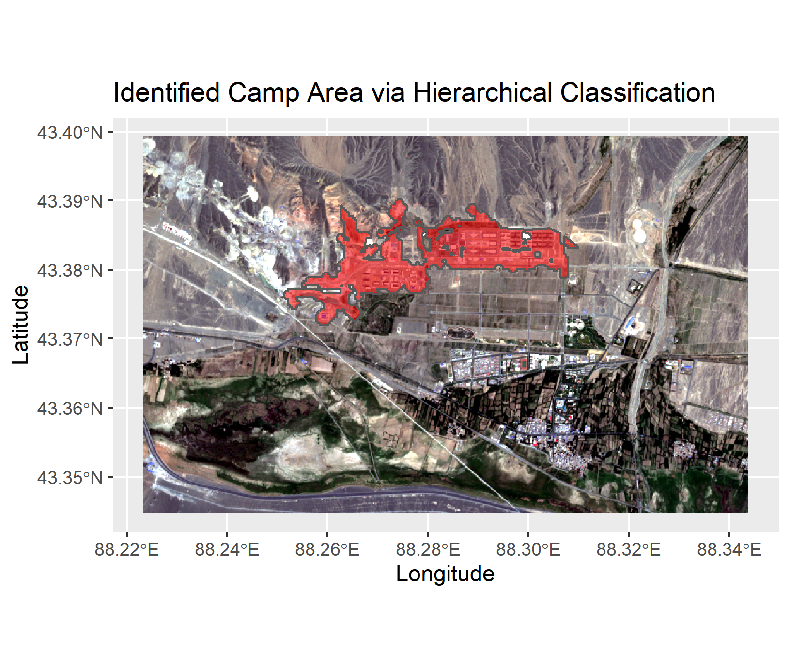

# FP_re-ed
# **Final Project on Re-education Camps in Xinjiang**

## **Background**
The purpose of this script is to analyze re-education camps in the Xinjiang region in which the Chinese government is interning Moslem minorities.
Until now the detection of these camps is mainly done manually by journalists reviewing various articles, press releases etc. which is quite a time-consuming task.
Therefore, this script explores methods to detect these camps more automatically by combining features from multiple data sources. 

## **Analysis**
This analysis focuses on the biggest known re-education camp in Dabancheng, Ürümqi. But it may be enhanced and applied as a basis for further analyses and bigger areas of interest.

Sentinel-2 scenes from two years 2017 and 2020 are used as during this timeframe the most camps were built and mostly fully constructed.

It must be mentioned that this analysis is only applicable to newly constructed camps, not to those for which the building had already existed but was only transferred to a camp from a former usage type.

Data sources:
Natural Earth, OSM, Sentinel2 (ESA), SRTM (NASA), The Xinjiang Data Project, VIIRS (NASA)

A hierarchical classification scheme was applied using masking to filter out areas unlikely to inhabit a camp.
The following metrics were used to identify potential camp areas:
1. **Nightlights Data (VIIRS)** to identify built-up areas which are lit up during the night
2. **Digital Elevation Model (SRTM)** to filter out areas with a high area and slope
3. **SAVI (Soil Adjusted Vegetation Index)** to mask vegetated areas (camps are assumed to have little to no vegetation) 
4. **CVA (Change Vector Analysis)** to identify areas with high change between 2017 and 2020
5. **Texture** to mask areas with low variance (camps area assumed to have a high variability due to metal roofing, multiple buildings of different types & sizes, fences etc.)

The assumptions are based on the information provided by The Xinjiang Data Project:
https://xjdp.aspi.org.au/data/?tab=datasets#

The hierarchical classification using a multi-criterion masking procedure correctly identifies the targeted camp. Additionally, it identifies the extension of the camp which is still under construction.

## **Outlook**
For further analysis it might be interesting to look into additional features of the re-education camps besides their size, as e.g. their minimum distance to urban structures and road infrastructure. 
Additionally, an Object-Based Image Analysis using segmentation could be useful to exploit the full potential of the 15-meter spatial resolution bands of the Sentinel-2 satellite data.
